# FilmFunFair

> SSAFY 1학기 마지막 프로젝트
>
> **21년 06월 28일 09시** 프로젝트 종료! 
>
> 그동안 정리안하고 작성만 한 README와 프로젝트 차차 업로드 할 예정입니다!

> :cherries:06.11 **최종 프로젝트 업로드 완료**!!!:cherries:
>
> :point_right: **pair님​**:point_left:의 노력으로 **완전 깔끔**하게 정리된 프로젝트 업로드 성공!!!
>
> 흑흑... 마지막까지.. 무한 감사 :sob: ~~최고다 정말ㅜㅜㅜㅜ~~

- **기간**
  - 21.05.20 (wed) ~ 21.05.28 (fri)
- **프레임워크**
  - Frontend: `Vue.js` v 2.6.12
  - Backend: `Django` v 3.2.3

- **역할분담**
  - `Pair` : Full Stack + 추가적인 신기한 기능 주로 담당
  - `Me` : Full Stack + 세부적인 디자인 주로 담당

- **주제**
  - 영화 정보 커뮤니티 웹페이지 제작
- **특징**
  - `돋보기 기능`을 활용한 웹페이지 시작 화면
  - 개인 영화 추천
    - 시청 기록을 활용한 `유사 아이템 기반 추천 알고리즘`
    - `Vue-3d-Carousel` 활용
  - 랜덤 영화 추천
    - 한가지 영화 랜덤 추첨
    - `카드 뒤집기`애니메이션 사용
  - 영화 리스트
    - 포스터에 `마우스 hover 시` 간단한 영화 정보 제공
    - 인피니티 스크롤
  - `검색기능`
    - 영어 대소문자 구분 X, 한글 초성 검색 가능
  - `깔끔한 디자인`
    - 영화 상세페이지, 커뮤니티, 마이페이지 등 깔끔한 디자인
  - `배포`
    - Frontend : **Netlify**
    - Backend : **Nginx**

 

### **결과페이지** :framed_picture:

- **Home**

  - `Main`

  

  - `Login, Signup Modal`

    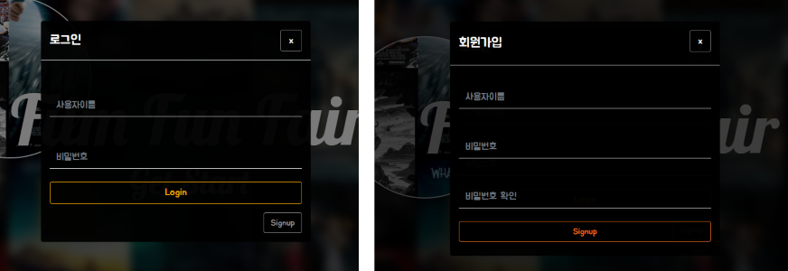

- **MovieList**

  - `Movie Recommendation`

    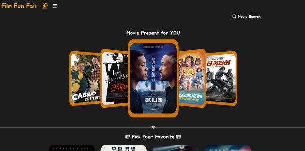

  - `Movie Search`

    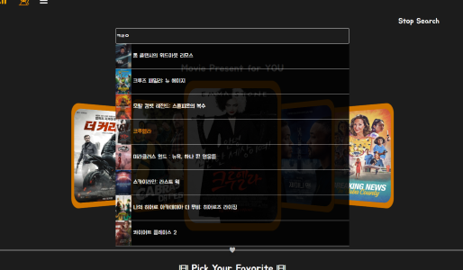

  - `Movie List`

    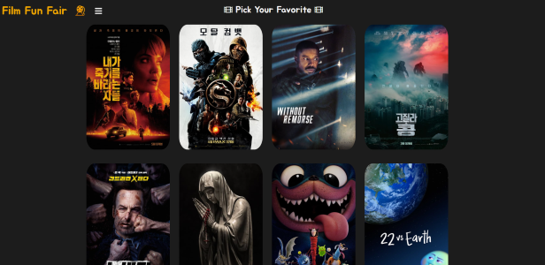

  - `Movie Caption`

    

  - `Movie Detail Modal`

    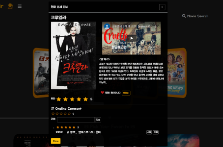

- **Mypage**

  - `Like Movie` & `Watched Movie`

    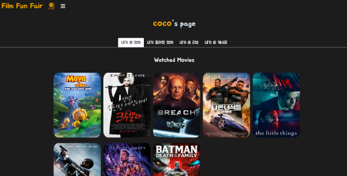

  - `My Review`

    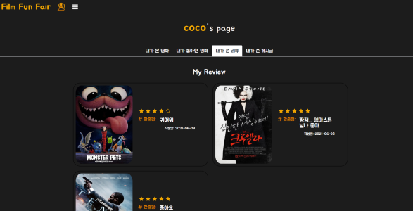

  - `My Post`

    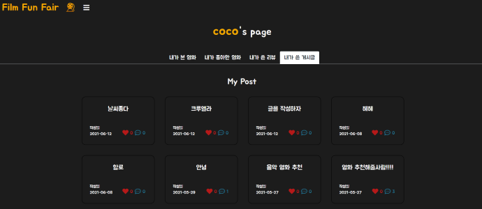

- **Community**

  - `Community List`

    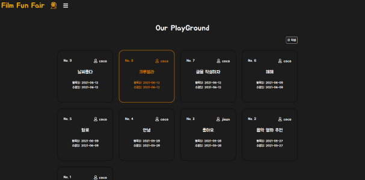

  - `Community Detail`

    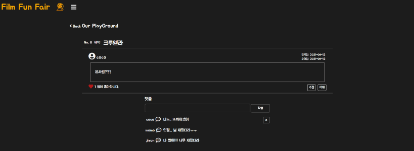

  - `Update & Create Form`

    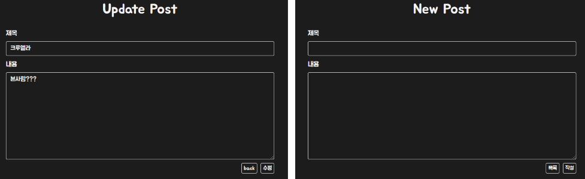

- **Random**

  - `card`

    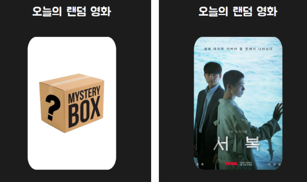

 