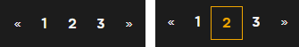

###### 210526

# Seventh Programming :see_no_evil:

> 디자인 이쁘게 하구싶다구우

### 오전

1. MyPage - **MyMovieInfo**

   - 영화 **상세 캡션**(hover하면 보이는 상세) 수정

     - 전체적인 가운데 배치
     - 버튼, 좋아요 디자인 변경
     - 글자 크기 확대
     - 모서리 둥글게! (너무 각진 느낌이라 딱딱...)

   - 영화 **배치** 수정

     - 한 줄에 5개씩 보이도록!

     - 살짝 부족하지만... `flex-wrap`을 사용해서 반응형처럼 보이도록 했다

       ```css
       .mymovie-flex-container {
         display: flex;
         flex-wrap: wrap;
         margin: 0 7vw 0 15vw;
       }
       ```

2. 검색 **대소문자 구분 수정**

   - 영어 검색에서 `대소문자 구분안하고 검색되도록` 하자!

     ###### 예전에 했었는데... 수정하면서 빼먹었다..ㅎㅎ

   - 정규식 변환시 `'i' 속성`을 넣어주면 된다!

     ```javascript
     new RegExp(pattern, 'gi');
     ```

<br>

:kiwi_fruit: 맛점하구 힘내쟈

<br>

### 오후

##### 커뮤니티페이지 수정사항

- 원래 페이지네이션! 하려고 했는데 잘안되서 **인피니티로 변경**!!

  ###### 수정하는건 페어님이 해주셨다:D

- 디자인은 미리 해놨는데 이건 나중에 써먹으려고 저장ㅎㅎ

  ###### 부트스트랩 커스텀한건데 나중에 또 하나하나 찾기 ~~귀찮...~~ 힘들다구

  

  ##### template

  ```html
  <!-- 글 작성 버튼 및 페이지네이션 -->
  <div class="table-page d-grid gap-2 d-md-flex justify-content-center">
    <!-- 페이지네이션 일단 붙여넣기 -->
    <nav aria-label="Page navigation ">
      <ul class="pagination">
        <li class="page-item">
          <a class="page-link" href="#" aria-label="Previous">
            <span aria-hidden="true">&laquo;</span>
          </a>
        </li>
        <li class="page-item"><a class="page-link" href="#">1</a></li>
        <li class="page-item"><a class="page-link" href="#">2</a></li>
        <li class="page-item"><a class="page-link" href="#">3</a></li>
        <li class="page-item">
          <a class="page-link" href="#" aria-label="Next">
            <span aria-hidden="true">&raquo;</span>
          </a>
        </li>
      </ul>
    </nav>
  </div>
  ```

  ##### style

  ```css
  /* 전체적인 너비 조정해서 가운데 오도록 */
  .table-page {
    display: flex;
    flex-wrap: wrap;
    margin: 0 15vw;
  }
  /* 페이지 네이션 색 조정 */
  .table-page * a,
  .table-page * a:visited {
    color: #F4F4F4;
    background-color: rgb(0, 0, 0, 0.01);
    border: 0;
  }
  /* 마우스 올렸을 때 색 */
  .table-page * a:hover,
  .table-page * a:active {
    background-color: rgb(0, 0, 0, 0.01);
    border: 1px solid #F0A500;
    color: #F0A500;
  }
  ```

<br>

1. Mypage - **MyReviewInfo** 디자인 (별점빼고)

   - 박스 크기 조정 및 모서리 둥글게!

   - 글씨 크기 조정 및 배치

   - 최신순이 위로 올라오도록 `reverse()` 사용

     ```javascript
     this.myPostMovies = res.data['my_movies'].reverse()
     ```

2. Mypage - **MyPostInfo** 디자인

   - `제목`, `좋아요`, `댓글` 정보 배치

   - 제목 길어도 1줄만 보이도록 설정

     - 글자 크기에 맞춰서 `line-height` 조정
     - `-webkit-line-clamp`로 표시하고자하는 라인수 조정 (해당 줄에 ...을 붙임)

     ```css
     /* 타이틀 너무 길어지면 자름 */
     .postTitle-limit {
       overflow: hidden;
       text-overflow: ellipsis;
       display: -webkit-box;
       line-height: 25px;
       max-height: 60px;
       -webkit-line-clamp: 1; /* 표시하고자 하는 라인 수 */
       -webkit-box-orient: vertical;
     }
     ```

   - 클릭하면 `해당 게시글로 이동`

     ##### template

     - 클릭시 post.id를 인자로 전달하여 `clickPost`함수 실행

     ```html
     <div class="postBox" @click="clickPost(post.id)">
       <!-- 생량 -->
     </div>
     ```

     ##### javascript

     - 해당 게시글로 라우터 변경

     ```javascript
     clickPost(postId) {
       const strPostId = postId + ""
       this.$router.push({ name: 'CommunityDetail', params: {postId:strPostId} })
     },
     ```

3. **MovieDetailModal** 디자인

   - Modal 전체 `background color 변경`

     - bootstrap-vue의 `b-modal`을 사용
     - 커스텀을 위해 전체 구조를 하나하나 확인하면서 했다
     - 다음처럼 상위 modal에서 modal-content에 접근해줘야 한다

     ```css
     .modal .modal-content{
       background-color: rgb(0, 0, 0, 0.95);
       color: #F4F4F4;
     }
     ```

   - Modal 헤더의 제목 및 버튼 커스텀

     ##### :fire: 버튼 커스텀시 문제 발생!

     - `Login Modal`도 같은 b-modal을 사용하여 `같은 class를 공유`한다

     - MovieDetailModal에만 맞게 버튼 크기 조정시 Login Modal에서는 모양이 이상해졌다

     - `css속성`을 해당 위치로만 `한정할 수 없음`

       전체적인 배경이나 다른 설정은 공유하는것이 편함

       하위 컴포넌트에 적용되야하는 속성도 존재

     ##### :four_leaf_clover: 해결방법

     - `공유할 수 있는 버튼 모양 디자인`

       두 위치 모두에서 거슬리지 않을 정도의 font-size와 버튼 크기를 찾았다!

   - `영화 정보 배치`

     - 처음 디자인한 것을 기반으로 배치
     - 같은 방향으로 배치되야하는 것들을 하나로 묶어 `display: flex;`를 사용했다!! :+1:
     - 좋아요, 봤어요 버튼 배치 및 효과

   ###### 오래걸렸기도하구... 아직 많이 남았지만 뿌듯! 맘에 든다

4. **시연 영상 제작** :video_camera:

   - 27일 오전까지 제출이라 지금까지 만든 페이지를 기반으로 제작했다!

   - `pair님의 뛰어난 아이디어와 실력`:sparkles: 덕분에 수월하게 찍었다!​!!!

   - me가 한거라곤 사진 한두개, 짧은 영상 1개, pair님의 수고에 대한 **진!심!어!린! 리액션**...

   - 마지막에 인코딩:anger: 이 화나게 했지만.. 결과적으론 제출 성공!

   - 뛰어나신 **연기의 신** pair님께 박수 :clap::clap::clap: ~~...이거 설마 안보시겠지..?~~

     ###### 놀리는거 아니구 칭찬~ㅎㅎ

5. **MovieDetailModal** 디자인 - **평점 및 리뷰**

   - `평점` : bootstrap-vue의 `b-form-rating` 사용

     ##### :fire: 별점 반개가 안된다..!

     - 반개는 값을 보여줄때만 되고, 내가 평점을 입력할 때는 한개씩만 선택된다
     - 다른 라이브러리 시도는 실패

     ##### :tongue: 타협

     - 별점은 0점에서 5점까지 **1간격으로 받기로 결정**!!

   - `리뷰` 

     - 입력 form 커스텀 및 리뷰 배치 디자인
     - 수정시 등록된 리뷰 위치가 수정 form으로 바뀌도록 디자인

6. **LoginModal** 디자인

   - 입력 form에 흰 밑줄이 그어진 형태로 디자인!

     - bootstrap-vue의 modal에 존재하는 `b-form-input`을 사용
     - `.modal-body`아래 `.form-control`을 건드리는 형태로 커스텀

     ##### :fire: Form focus시에 박스 주변이 빛남!

     - bootstrap에 포함된 form을 쓰는 경우, focus시 입력 박스가 빛나는 문제

     ##### :four_leaf_clover: box-shadow 설정으로 해결

     - focus되어도 빛나지 않도록 설정함!

       ```css
       .modal-body .form-control:focus {
         box-shadow: none;
       }
       ```

   - `Enter`눌러도 로그인 되도록 수정

     ```html
     @keyup.enter="login"
     ```

7. **SignupModal** 디자인

   - 버튼 색 및 배치 변경

8. **SideMenu 닫는 버튼 수정**

   - side menu가 열리면 x모양 버튼이 보이는 형태

   ##### :fire: 버튼 위치가 화면크기에 따라 다르다

   - pair님의 큰 화면에서는 버튼이 side menu의 경계에 걸쳐 보인다... 큰일..

   ##### :four_leaf_clover: 위치 변경으로 해결 (꼼수..)

   - side menu의 바깥쪽 옆에 X 버튼이 보이도록 디자인 변경
   - nav에서 버튼의 위치를 바꾸고, side menu가 보이는 경우에만 나타나도록 만들었다!!!
   - ~~약간 꼼수지만... 이정도면 괜찮지 않나..?~~

<br>

<br>

## 오늘의 느낀점 :clown_face:

- 아니 진짜 **bootstrap 커스텀** 하기 **너무 힘들다**ㅜㅜㅜㅜ
- 클래스 하나하나 찾아서해야하구ㅜㅜㅜ
- 그치만 하고난 **결과물** 보니까 너무 **뿌듯**...ㅜ
- 뭐든 하려고 들면 **안될게 없다**는 걸 다시 한번 느낀다
- 오늘도 역시 pair님께 감탄... 하루하루 감탄한다 많이 배워가야지ㅎㅎ
- 이제 거의 마무리 되어서! 내일 전체적으로 손보고 마무리하면 될 것 같다
- 이제까지 진짜 수고했다ㅜㅜㅜ 하루만 더 힘내쟈

