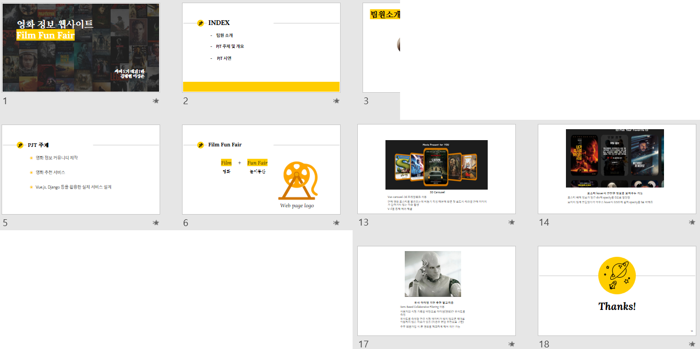

###### 210527

# Eighth Programming :raised_hands:

> 오늘까지 하면 끝난다!!!

<br>

## :man_teacher: 교수님 피드백

> 전체적인 페이지 구성과 디자인에대해 교수님께 피드백을 받아봅니다!!

#### Home (첫화면)

- **웹페이지 이름 블러 앞으로 빼기**
  - 중요한 정보는 잘보이도록!!!
- 돋보기 크기 키우기
  - 포스터 하나가 들어갈 크기로 키우자
- **로그인 모달 키우기**
  - 약간 작은 것 같다!
  - 키워보고 괜찮으면 사용하자

#### MovieList 전체

- **컬러 변경** - `포인트 색은 딱 포인트 되는 부분만!!`
  - **메인 컬러**는 조금만, **강조하고 싶은 위치**에 쓰자 
  - **3d-carousel 배경 무채색**으로 하는게 나을 듯
  - side menu 색도 덜 튀는 색으로 변경
  - **햄버거버튼 흰색**이 좋을 듯함 (side menu 여는 버튼)

#### MovieList - 검색

- **검색창 여는 버튼** 
  - **가독성있게** 수정!
  - 검색 관련 아이콘 넣기 + 흰색
- **검색 결과 창**
  - 왼쪽 정렬
  - **다른 요소의 위쪽**에 나타나는게 좋음! (창 나타나는 것에 따라 다른 요소가 밀리지 않게)
  - 앞으로 나오게 하든, 밑에를 absolute해서 안움직이게 하든...

#### MovieList - 영화 리스트

- 배열 및 이미지 크기 맞춘거 좋음
- infinity scroll 색도 깔끔하고 좋음

- **포스터 그림자**
  - 배경이 어두워서, 어두운 포스터는 구분이 잘 안간다
  - 그림자 넣어보고 괜찮으면 사용하기
- **영화 상세**
  - 디자인은 좋음!
  - 평점...건드리면 줄어드네..? :astonished: 시연할 때 건드리지 말도록..!

#### Mypage

- Q) Mypage에서 **영화 봤어요를 취소**하면 **상세페이지를 바로 나가지는데** 괜찮나요??
  - R) 괜찮음! **서비스 측면에선 안내를 띄우던지** 하는게 좋음 (지금 중요한 건 아님)
- **MyPost 한 줄에 좀 적게** 넣어도 될 듯

#### CommunityList

- **배치 변경**
  - **Mypage랑 동일**하게 **박스 구성**으로 가도 좋을 듯!!
- 다른 부분은 괜찮다

#### Random

- 카드 활용 좋음!
- 하나만 쓸거면 **크기 키우면 좋을 듯**

#### 웹페이지 데이터

- **유의미한 데이터를 채워넣자**
  - 네이버 같은데서 데이터 긁어와서 쓰기
  - 게시글, 리뷰 등등 

#### 화면에 커서??

- 웹페이지 전체적으로 계속 커서가 생긴다??
- 이유는 잘 모르겠음...
- 해결할 수 있으면 하고, 안되면 시연에서 조심하기

#### 추가적인 질문

- Q) **SIdemenu** Logout버튼, 화면크기에 상관없이 동일하게 배치할 방법??
  - R) 화면으로 조정하고 싶으면 vw, vh / %는 부모에 따라 설정가능
- Q) console에 에러나는것...why...??? 어떻게 하져
  - R) null 핸들링 안해줘서 나는 것 같은데... 일단 찾을 수 없고 프로그램 잘 되면 놔두기

<br>

### 당장 수정할 것 정리

- Home
- 전체적인 color

<br>

###### 갑자기 수정해볼 것 왕창!!! 교수님 감사합니다 :+1:

<br>

## 해결해보자!

1. **Home 글자 위치** (feat. **pair님**)

   - 블러 앞으로 글자 배치
     - 제목과 버튼을 감싸서 `z-index` 설정
   - 중앙배치
     - 글자를 한번 더 감싸서 `flex` 사용
     - `height: 100%`로 화면 전체로 설정!!

   ##### template

   ```html
   <div class="main-title-compo">
     <h2 class="main-title-fff">
       Film Fun Fair
       <div class="getstart">
         Get Start
       </div>
     </h2>
   </div>
   ```

   ##### style

   ```css
   .main-title-fff {
     /*생략*/
     position: absolute;
     z-index: 100;
     /*생략*/
   }
   
   .main-title-compo {
     display: flex;
     justify-content: center;
     align-items: center;
     width:100%;
     height: 100%;
     position: absolute;
     top: 0;
     left: 0;
   }
   ```

<br>

2. MyPage - **MyPost 디자인 변경**
   - 한줄에 4개 배치
   - 제목, 등록일, 좋아요, 댓글 재배치

<br>

3. **CommunityList 디자인 변경**
   - Mypage와 동일한 박스 구성으로 변경
   - 게시글 번호, 작성자, 제목, 등록일, 수정일 배치
   - hover시 애니메이션

4. **Logo** 크기 및 폰트 수정

5. **검색창 구성** (feat. **pair 님**)

   - 검색창과 **동일한 크기**로 아래 배치
     - 전체를 감싸 `flex` 사용 + 검색창과 동일한 `margin`
   - 다른 요소 **위에 배치**
     - `position: absolute;`로 위치 고정
     - `z-index`로 위에 배치
   - 영화 **왼쪽 배치** 및 **구분선**
     - `justify-content: left;`
     - border-bottom

   ##### template

   ```html
   <div class="test12">
     <div class="search-result-container" v-if="isSearch">
       <Search 
         class="search-results"
         v-for="movie in matchedLists" 
         :key="movie.id"
         :movie="movie"
       />
     </div>
   </div>
   ```

   ##### style

   ```css
   .test12{
     display: flex;
     flex-wrap: wrap;
     margin: 0 30vw 20px 30vw;
     flex-direction: column;
     position: relative;
   }
   .search-result-container {
     background: black;
     position: absolute;
     z-index: 1;
     width: 100%;
     opacity: 0.85;
   }
   .search-results {
     display: flex;
     justify-content: left;
     border-bottom: 1px solid #F4F4F4;
     font-size: 18px;
   }
   ```

<br>

6. **ppt 제작**

   - 내일 발표를 위한 ppt 제작!!

   - google presentation 활용해서 동시 작업!

     

<br>

7. **커서문제 해결**

   ###### G선생께서 답을 알려주셨다!!! [여기 참고!](https://seeminglyjs.tistory.com/225)

   1. Chrome 실행
   2. 왼쪽위 메뉴바 - [설정] - [고급] - [접근성]
   3. `텍스트 커서로 페이지 탐색` 해제

8. **MovieList 검색버튼 수정**
   - 검색 버튼인지 알아보도록 `아이콘 + 이름 수정`
   - 위치 변경
   - 닫는 버튼도 직관적으로 수정
   - 버튼 누르면 기존 `검색 창 사라지도록 변경`

<br>

###### 데이터 넣기 전! 최종 수정@@@

9. Mypage - **MyReviewList 영화와 리뷰 매치**

   ##### :fire: 자세히 확인해보니 `리뷰랑 영화 포스터랑 매치가 안된다`!!!!

   ##### :four_leaf_clover: 해결!!

   - review정보는 최신순으로 배치위해 `reverse()` 사용
   - movie정보에도 동일하게 `reverse()` 사용해줌

10. **community**
    - 글자 크기 키움
    - `comment form`, `community form` 쉐도우 수정
    - comment 배치 수정

##### 등등... 세부적인 조정 끝에 디자인 완성!!!!! :confetti_ball: :bouquet:

<br>

#### 데이터 넣기!!!!

- 시도...했으나...
- API로 넣어주는게 아니라 **직접 일일이 넣어줘야한다고...?????** :astonished:
- 둘이 동시에 데이터 작성하고 싶은데ㅜㅜㅜ 한번에 local에 접속할 방법이 없네ㅜㅜ

##### :facepunch: 과감하게 배포하기로 했다!!!

<br>

<br>

## 배포 (Deploy) :computer:

#### Backend - `Django`

- 준비
  - Django project
    - 완성(오류 없는) / requirements.txt / 원격저장소 업로드
  - [AWS](https://aws.amazon.com/ko/)
    - 계정 생성, 카드 등록 및 인증 완료
    - 가장 많이 사용함!

**Cloud9**

> 원격저장소(클라우드 컴퓨팅)에 접속 편하게 하기위해 이용할 코드 에디터!
>
> 하루종일 돌아가는 컴퓨터에 서버를 올려 서비스 제공하자

- [AWS Management Console] - [Cloud9 검색] - [**Create environment**]

- 이름 입력 후 Next Step

- 설정

  - Platform - `Ubuntu Server` 18.04 LTS

  - Cost-saving setting - `After 30 minutes`

    일정시간 후 꺼지도록 설정가능 (Never 설정시 과금주의)

- [Next step] - [Create environment]

- 생성 완료 후 **cloud9 화면** 확인

- **파일트리 설정** (home directory기준으로 진행) : 톱니바퀴 아이콘 클릭

  - Show Environment Root 체크해제
  - Show Home in Favorites 체크 (show Hidden Files도 체크)

<br>

##### EC2

> 새로운 탭에서 EC2 인스턴스를 실행하자!
>
> cloud9 생성 시 자동으로 생성된다
>
> 대시보드에서 사용중인 인스턴스를 볼 수 있다

- [AWS Management Console] - [EC2 검색]

- [보안그룹] - 생성된 보안그룹 ID 클릭

- 화면 하단 - [**인바운드 규칙 편집**]

- **규칙 추가** 후 저장 

  ###### 인스턴스에 접근할 수 있도록(외부 접근가능하도록) 하는 들어오는 규칙

  - 포트 범위 : `80`
  - 소스 : `0.0.0.0/0` , `::/0` (모든 아이피에대해 열어주겠다)

<br>

##### 서버 설정

> 이후 내용은 cloud9 터미널에서 진행!!

- **pyenv 설치** :point_right: [확인](https://github.com/pyenv/pyenv)

  ```shell
  git clone https://github.com/pyenv/pyenv.git ~/.pyenv
  echo 'export PYENV_ROOT="$HOME/.pyenv"' >> ~/.profile
  echo 'export PATH="$PYENV_ROOT/bin:$PATH"' >> ~/.profile
  echo 'eval "$(pyenv init --path)"' >> ~/.profile
  echo 'eval "$(pyenv init -)"' >> ~/.bashrc
  ```

  ```bash
  exec "$SHELL"
  ```

  - 그 뒤 **터미널 재시작**

- pyenv 설치 확인

  ```shell
  pyenv -v
  
  # 출력 확인 => pyenv 2.0.0
  ```

- **python 설치** (프로젝트에서 사용한 버전 설치)

  ###### 좀 오래걸린다...

  - global 설정 후 버전확인

  ```shell
  pyenv install 3.8.7
  pyenv global 3.8.7
  python -V
  #=> Python 3.8.7
  ```

<br>

##### project clone

> gitlab에 있는 프로젝트를 가져오자
>
> **루트폴더**와 **프로젝트폴더**, 두개의 이름에 주의!!!!! (통일하면 조금 더 편하게 설정 가능!)

- **clone**

  - home을 기준으로 진행한다
  - gitlab의 username(id), password 입력

  ```shell
  cd ~ 
  git clone {project_remote_url}  
  #이렇게하면 django프로젝트가 옆에 보인다!
  ```

- **폴더 구조**

  - 프로젝트 이름은 변수처럼 사용예정 이름을 기억하기!!
  - 편의를 위해 **루트와 프로젝트 폴더 이름 동일하게** 변경

  ```shell
  home/
  	ubuntu/
  		{루트폴더}
  			{프로젝트폴더}
  			{앱}
  			manage.py
  			requirements.txt
  ```

- 루트 폴더로 이동

  ```bash
  cd ~/{루트폴더}
  ```

- 가상환경 생성 (가상 환경 이름 기억!)

  ```shell
  python -m venv venv
  ```

- 가상환경 activate (window와 명령어 다름 주의!!)

  ###### 이렇게 하면 (venv)가 앞쪽에 생김!

  ```shell
  source venv/bin/activate
  ```

- **라이브러리 설치**

  ```shell
  pip install -r requirements.txt
  ```

- **마이그레이션**

  ```shell
  python manage.py migrate
  ```

- **createsuperuser**

  ```shell
  python manage.py createsuperuser
  ```

- **loaddata** (fixture가 있는경우)

  ```shell
  python manage.py loaddata {data.json}
  ```

- **collectstatic**

  ###### 이미지, css, js같은 static 파일 사용하는 경우 루트 폴더에 모아줍니다

  - `settings.py`

    ###### 맨 아래 붙여주기!

    ```python
    import os
    
    STATIC_ROOT = os.path.join(BASE_DIR, 'staticfiles')
    ```

  - collectstatic

    ```shell
    python manage.py collectstatic
    ```

<br>

##### nginx

> client가 요청 보내면 nginx가 요청 받아서 보내줌! (django는 서버에서 돌아가는 하나의 프로그램)
>
> **vim을 사용**하여 터미널에서 파일 수정!! 사용법 숙지하자

- **설치**

  ```shell
  sudo apt-get update
  sudo apt-get install -y nginx
  ```

- **복사할 코드** 작성

  - 각자의 프로젝트 이름에 맞게 수정 후 메모장에 입력!
  - staticfiles의 경우 다른 폴더를 썼다면 이름수정

  ```python
  server_name *.compute.amazonaws.com;
  
  location / {
  	uwsgi_pass unix:///home/ubuntu/{루트폴더}/tmp/{프로젝트폴더}.sock;
  	include uwsgi_params;
  }
  
  location /static/ {
  	alias /home/ubuntu/{프로젝트폴더}/staticfiles/;
  }
  ```

- **파일 수정**

  ```shell
  sudo vi /etc/nginx/sites-enabled/default
  ```

  - **vim 명령어**

    - `i` : 수정모드로 전환
    - 방향키 이용, 아래부분으로 이동
    - 수정
    - `esc`로 수정모드 빠져나오기
    - `:wq` 명령어로 저장 후 종요

  - 수정 전

    ```shell
    root /var/www/html;
    
    # Add index.php to the list if you are using PHP
    index index.html index.htm index.nginx-debian.html;
    
    server_name _;
    
    location / {
    # First attempt to serve request as file, then
    # as directory, then fall back to displaying a 404.
    try_files $uri $uri/ =404;
    }

  - 수정 후

    ```shell
    root /var/www/html;
    
    # Add index.php to the list if you are using PHP
    index index.html index.htm index.nginx-debian.html;
    
    #server_name _;
    
    #location / {
    # First attempt to serve request as file, then
    # as directory, then fall back to displaying a 404.
    #       try_files $uri $uri/ =404;
    #}
    
    server_name *.compute.amazonaws.com;
    
    location / {
    	uwsgi_pass unix:///home/ubuntu/{루트폴더}/tmp/{프로젝트폴더}.sock;
    	include uwsgi_params;
    }
    
    location /static/ {
    	alias /home/ubuntu/{프로젝트폴더}/staticfiles/;
    }
    ```

<br>

##### uWSGI

> 웹서버를 중개하는 역할!!

- 설치

  ```shell
  pip install uwsgi
  ```

- 루트 폴더 이동 (기존의 위치와 동일)

  ```shell
  cd ~/{루트폴더}
  ```

- uwsgi 설정, 로그 저장할 폴더 생성 (파일트리에서 생성해도 무방)

  ```shell
  mkdir tmp
  mkdir -p log/uwsgi
  mkdir -p .config/uwsgi/
  ```

- uwsgi 설정파일 생성 (파일트리에서 생성해도 무방)

  ```shell
  touch .config/uwsgi/{프로젝트폴더}.ini
  ```

- `uwsgi.ini` 수정

  ```shell
  # {루트폴더}/.config/uwsgi/{프로젝트폴더}.ini
  
  [uwsgi]
  chdir = /home/ubuntu/{프로젝트폴더}
  module = {프로젝트폴더}.wsgi:application
  home = /home/ubuntu/{루트폴더}/{가상환경이름}
  
  uid = ubuntu
  gid = ubuntu
  
  socket = /home/ubuntu/{프로젝트이름}/tmp/{프로젝트폴더}.sock
  chmod-socket = 666
  chown-socket = ubuntu:ubuntu
  
  enable-threads = true
  master = true
  vacuum = true
  pidfile = /home/ubuntu/{프로젝트폴더}/tmp/{프로젝트폴더}.pid
  logto = /home/ubuntu/{프로젝트폴더}/log/uwsgi/@(exec://date +%%Y-%%m-%%d).log
  log-reopen = true
  ```

<br>

##### daemon

- 설정파일 생성

  ```shell
  touch .config/uwsgi/uwsgi.service
  ```

- `.config/uwsgi/uwsgi.service` 설정파일 수정

  ```shell
  [Unit]
  Description=uWSGI Service
  After=syslog.target
  
  [Service]
  User=ubuntu
  ExecStart=/home/ubuntu/{루트폴더}/{가상환경이름}/bin/uwsgi -i /home/ubuntu/{프로젝트폴더}/.config/uwsgi/{프로젝트폴더}.ini
  
  Restart=always
  KillSignal=SIGQUIT
  Type=notify
  StandardError=syslog
  NotifyAccess=all
  
  [Install]
  WantedBy=multi-user.target
  ```

- 심볼릭링크 생성

  ```shell
  sudo ln -s ~/{프로젝트 이름}/.config/uwsgi/uwsgi.service /etc/systemd/system/uwsgi.service
  ```

- 등록 (아래의 명령어 모두 실행)

  ```shell
  # daemon reload
  sudo systemctl daemon-reload
  
  # uswgi daemon enable and restart
  sudo systemctl enable uwsgi
  sudo systemctl restart uwsgi.service
  
  # check daemon
  sudo systemctl | grep nginx
  sudo systemctl | grep uwsgi
  
  # nginx restart
  sudo systemctl restart nginx
  sudo systemctl restart uwsgi
  ```

- nginx status

  ```shell
  systemctl status nginx.service
  ```

- 80번 포트를 이미 사용중인경우 아래의 명령어 입력 후 **nginx restart** (등록 부분 명령어 있음)
  - `sudo lsof -t -i tcp:80 -s tcp:listen | sudo xargs kill`

<br>

##### 배포확인

- EC2 대시보드 - [인스턴스] 클릭 - 퍼블릭 IP로 접속(복사해서 주소창에)

- **DisallowedHost**

  - django는 기본적으로 허용한 유저만 접근할 수 있도록 설정하기때문

- **settings.py 수정**

  - 수정 후 **nginx 재시작**

  ```python
  ALLOWED_HOSTS = [
      '18.118.19.77'  #해당하는 퍼블릭 IP넣기
  ]
  ```

###### 이렇게 하면 배포 완료!!!


#### Frontend


- 배포시도
  - doc따라하면서 해서
  - 장고랑 vue둘다 배포는 했다
  - 근데....둘이 어떻게 연결하냐구ㅜㅜㅜㅜ
  - 연결이 되야 뭘 넣든 하지ㅜㅜㅜㅜㅜ
- 연결하는 방법을 찾아 고군분투...

- 병현님 친구분이 알려주신


- 로컬에서 된 이유가 주소가 맞아서 그럼
- 이걸 바꿔줘야함
- EIP를 해주면 좋음
- 그 통신하는 부분


- 친구분이 오셔서 도와주심!!!!!
- 그 ne~ 어쩌구 쓴거는 https라서 그것까지 연결해야함!
- 그리고 코드에서 전부 바꿔주고
- 


- 여기 도메인 공짜라고 알려주심!
  - https://xn--220b31d95hq8o.xn--3e0b707e/

- 와...

- 코드에 주소 전부 바꾸고dist올리니까 된다

- p


- 와...진짜 된다ㅜㅜㅜ 흑흑 넌나 신나ㅜㅜㅜ
- pgrep -f java


- 우리가 ㅏ배포한 서버!!!! 잘된다ㅜㅜㅜㅜ
  https://wonderful-nobel-b954e3.netlify.app/


- 백엔드는 ~
- 프론트는 넷플리파이
- 근데 도메인에 백엔드 연결해서...프론트는 서버가 엉망인데ㅋㅋㅋㅋ 어쨌든 다음에 할때는 프론트를 도메인에 연결하도록 하자


- 오전에 해보니까 안된다ㅜ 어제 서버 잘못 끈 듯
- 근데 페어님이 해결하심ㅜㅜㅜ 흑흑 무한감사
- 진짜 너무 최고다


## 28일 다른조 발표

- 로그인 화면 전황
  - css overflow
- 장르별 영화
  - tmdb에서 제공하는 장르 이용
- 검색 - 오타 거르고, 자음만 검색해도 되는거
  - 테이블을 만들어서 
  - django에서 자음만 뽑아내는 시스템 사용
  - 오타의 경우 : 다른 글자가 같은데 오타가 있으면 그 부분만 빠짐 (이제까지 본적 없는 기능이라고 하심!!!)

- 동그란 3d 캐러셀
  - 어디꺼 쓰셨다고...? 이쁘긴했는데
  - codepen.io 이거 참고 하셨다고!!!
  - https://codepen.io/edmundojr/pen/qdLWWx


- 배우찾기하는거 참신하다!
  - 감독이나 배우 찾고, 그 사람 관련 영상도 같이 나오는거 멋지다
  - 배우 사진 진짜 쨍하니 잘보여서 좋다

- 검색 자동완성
  - 멀티 셀렉터!!! 가져와서 쓰셨다고 합니다 진짜 완성도 있어

- 프리태그
  - 줄바꿈 해주는거!!!
  - 이거 구현하고 싶었는데 교수님이 말씀하심
- djano만 2조가 했는데 너무 깔끔하게 잘하셨다!!!
  - 바닐라 자바스크립트만으로도 이렇게 이쁘게 할 수 있다!!
  - 진짜 대단해ㅜㅜㅜ


- 진짜 프로젝트에 컨셉을 잡는게 좋은것 같아
  - 나현님은 레트로!!! 윈도우 98
  - 학일님조는 배우? 닮은거하셨나??
  - 어쨌든 그런거 진짜 기억에 남는다
- 비즈니스 로직도 알고 두루두루 알아야  개발을 잘할 수 있음


- 와... 영상 보면서 다른 팀들 보는데
- 3D 큐브로 화면 돌아가고 영화 보이는... 장난 아닌... 심지어 A반에서 만든거ㅋㅋㅋㅋㅋㅋ

- B반도... 장난아닌데...?
  - 로그인 유효성 검사도 해주고...
  - 자바반이라 뷰랑 맥은 MySQL썼다
  - 아파트 시세 알아보는거 지도보면서 볼 수 이쓴거 만들었는데
  - 와 진짜
  - 실제 제공되는 프로그램같다... 넘나 멋짐..