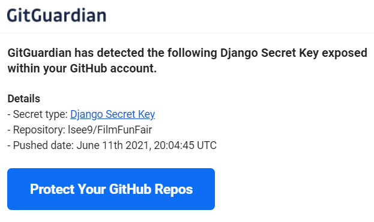
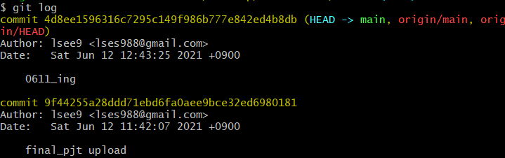
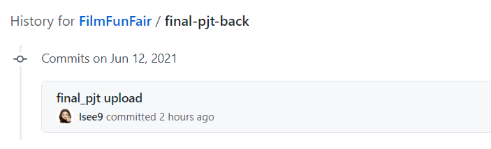

###### 210611

# Django Secret Key

> django secret key... 없애고 올려야 한다고...:anger:
>
> **교수님**도 말씀하시도 **pair님**도 몇 번 말해주셨는데 바보같이 그냥 올려버렸다..후
>
> 덕분에 **key를 숨기는 것** 뿐만 아니라 **Commit History**도 지워야했다ㅜㅜ ~~바보멍청이ㅣ~~
>
> 다른 분들이 잘 정리해주셔서 다행히 쉽게 하긴했다!!

<br>

##### 오늘의 내용 :hatching_chick:

- Ignoring Django SECRET_KEY
- Remove Commit History

<br>

<br>

### GitHub의 친절한 메일

> project 올리자 마자 친절하게도 메일이 날아왔다
>
> 아주 칭찬해..!



<br>

[공식문서에서 확인](https://docs.djangoproject.com/en/3.2/ref/settings/#std:setting-SECRET_KEY) :point_left:

### What is SECRET_KEY???

###### !!!!!!**Keep this value secret**!!!!!

- SECRET_KEY를 노출하면 **보안에 취약**해진다!!
- 따라서 원격저장소에 push할 때, 자동으로 **push되지 않도록** 해야한다
- **방법**
  1. `환경변수`로 관리
     - local environment가 변경될 때마다 바꿔줘야한다 (불편할 듯..?)
  2. **`비밀파일`로 관리** :heavy_check_mark:
     - 비밀파일을 만든 뒤, `.gitignore`에 추가하는 방법

<br>

<br>

# Ignoring Django SECRET_KEY

> 파일을 만들어 SECRET_KEY를 **소중히** 보관하고!
>
> 불러와서 사용하도록 하자!!!

### 1. Isolate SECRET_KEY in `secretes.json`

- `settings.py`의 **SECRET_KEY**값을 복사

  ```python
  # SECURITY WARNING: keep the secret key used in production secret!
  SECRET_KEY = 'Django SECRET_KEY'
  ```

- **`secrets.json`파일 생성**

  - 프로젝트 최상위 위치 (`manage.py와 같은 위치`) 에 생성
  - `dict` 형태로 key값을 넣어준다

  ```json
  {
    "SECRET_KEY": "Django SECRET_KEY"
  }
  ```

- `settings.py`에서 `secrets.json` **import**

  ```python
  import os, json
  from django.core.exceptions import ImproperlyConfigured
  
  BASE_DIR = Path(__file__).resolve().parent.parent
  
  #to get SECRET_KEY
  secret_file = os.path.join(BASE_DIR, 'secrets.json')
  
  with open(secret_file) as f:
      secrets = json.loads(f.read())
  
  def get_secret(setting, secrets=secrets):
      try:
          return secrets[setting]
      except KeyError:
          error_msg = "Set the {} environment variable".format(setting)
          raise ImproperlyConfigured(error_msg)
  
  SECRET_KEY = get_secret("SECRET_KEY")
  ```

  - `BASE_DIR` (기존에 존재)
    - 프로젝트 **최상단 폴더**로 path지정
    - settings.py의 부모의 부모(`parent.parent`)
  - `with open(secret_file) as f:`
    - `secrets.json` 파일 열고, `json.loads`를 통해 **json 파일을 dict type으로 변환**
  - `get_secret()`
    - **import SECRET_KEY**

- **서버확인**

  - 아주 잘 돌아간다!!! 오예

<br>

### 2. `.gitignore`

- push할 때 포함되지 않도록 `secretes.json` 파일을 추가한다 (vscode로 열어서 수정했다)

  ```python
  secrets.json
  ```

<br>

###### 모든 프로젝트 완수했고 문제도 없다면!!!

### 3. push

- 하던대로 add, commit, push를 하면 된다!

<br>

#### 여기까지 하면 push 했을 때, 더이상 secret key가 보이지 않는다! :confetti_ball:

<br>

<br>

## Remove Commit History

> 만약 나처럼 이미 push해서 commit 기록에 SECRET KEY가 보인다면???
>
> 완벽한 보안을 위해 기록도 삭제해주자

- 다행히 **마지막에 project만 commit** 해줘서 **최근 몇개의 기록만 삭제**하면 됐다!

  ###### 운이 나쁘면 모든 history를 날려야 할수도.. :sweat_drops: 조심하쟈!!

<br>

### 1. Local에서 commit 삭제

- **commit 내용 파악**하기

  ```shell
  $ git log
  ```

  - 다음처럼 커밋 내용을 확인할 수 있다!!

  - 이런 경우를 위해 **commit message**를 **알아보기 쉽게** 쓰는걸 추천!! (**+ 하나 완성되면 commit**) :star:

    ~~예전 경험담이다...허허 지금은 많이 발전한...~~

  

- **commit 내용 삭제(remove)**

  - 최근 내역 한개 삭제

  ```bash
  git reset HEAD^
  ```

  - 최근 내역 **여러개 삭제**
    - `~삭제할개수`를 적어주면 된다

  ```bash
  git reset HEAD~6
  ```

  ###### 난 6개를 삭제하면 완전히 SECRET KEY를 제거할 수 있었다!!! 다행.. :relieved:

- 다시 `git log`를 하면 기록이 사라진 걸 확인할 수 있다

<br>

### 2. 원격 저장소(git repository) commit 갱신

- **원격 저장소**의 **commit 내역 갱신**

  - 삭제하고싶은 branch 이름을 적어주면 된다!!!

  ```bash
  git push -f origin "branch_name"
  ```

- 이렇게 하면 local의 commit 내역이 그대로 적용된다

<br>

### 3. Project Upload

- 여기까지 했다면 이제 **프로젝트를 다시 업로드** 해주면 된다!!!!
- `add`, `commit`, `push`!!

<br>

### 결과

- **깔끔**... **편안**... :drooling_face:

  


<br>

<br>

## :partly_sunny: ​오늘의 느낀 점 

- 원격 저장소에 올릴 때는 **보안상의 문제**를 꼭 **다시 한번 확인**하자!!!
- **commit** 기록 **알아보기 쉽게** 쓰자!!! (알아보기쉽게 써서 진짜 다행ㅜㅜㅜ)
