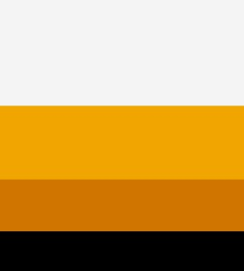
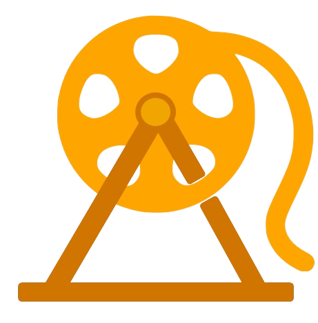
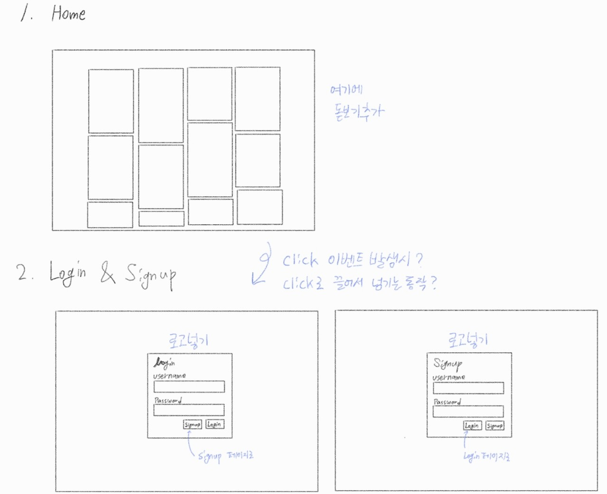
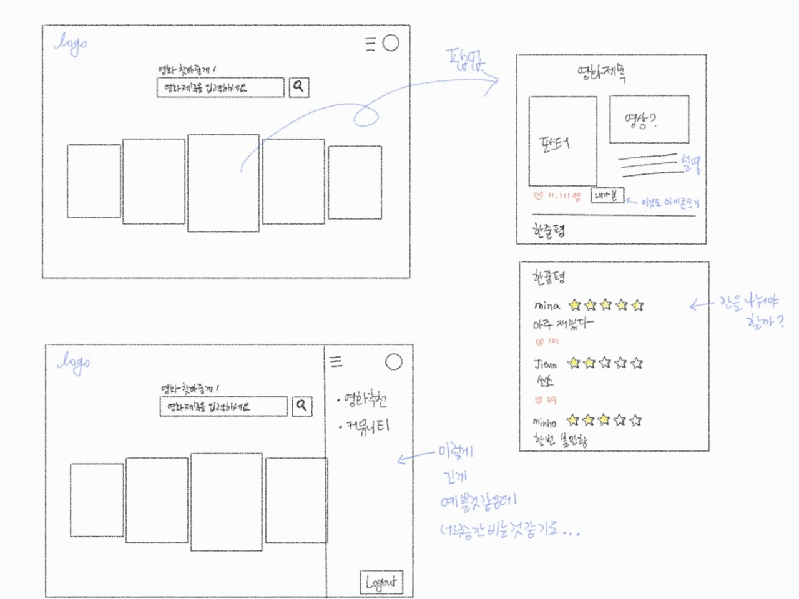
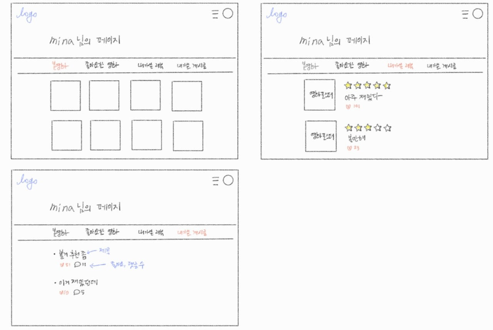

###### 210522

# Third Programming :tea:

> 후후...왜 벌써 토요일..?

### 오전

1. **검색기능**

   - 어제하던 검색의 연장선!

   ##### :fire: 구현한 검색의 문제점

   - `한글`은 인식이 안된다!
   - 글자 순서에 상관없이 매치되는 글자가 있으면 자동완성된다

   ##### :four_leaf_clover: 한글 해결 - 퍼지 문자열 매칭(fuzzy string matching)

   - 정확히 일치하지 않더라고 비슷한 느낌의 문자열 찾아주는 방법
   - `영문`
     - 입력한 **글자 사이에 어떤 문자든 올 수 있다**는 규칙
     - 정규식 변환 시, 'i' 속성을 통해 **대소문자 구분 없앰**
   - `한글`
     - 유니코드 한글문자 나열 규칙에 따른 음절 찾기
     - 자음만으로도 검색 가능!

2. 여러 라이브러리 시도... 실패

   - 검색을 좀더 제대로 해주는거나
   - Drop Down으로 검색어 보이게 할라구했는데 잘안된다ㅜㅜㅜ
   - 그렇게 오전시간은 안녕...

 

:baguette_bread: 점심먹고 아쟈!

 

### 오후

1. 검색기능 좀더 시도...
   - 결국 일단 DropDowm이랑 완전히 검색하는 기능은 제쳐두고...
   - 유사하게 검색하는거 하고싶었지만... 한글 자음까지 유사한거 검색하는 기능으로 마무리
   - 영어 대소문자 왜 갑자기 안되지...? 일단 지쳐서 패스ㅜ

2. **MovieList 디자인**하기

   - 3d캐러셀 시도

   - for문으로 접근하면 화면이 나타나질 않는다...ㅜ 

     ###### 왜 화면 크기 조정해야만 보이는거니...눈물...

   - 잘 안되서 일단 패스ㅜㅜㅜ

   - 아직 완벽히 구현되지 않아서 완성될 때 까지는 `new` 브렌치에 기록하기로 했다!

3. 전제적인 **디자인 논의**

   - `Film Fun Fair`

     - Film (영화) + Fun Fair (놀이동산) : 영화 놀이동산
     - fff (포르티시시모) : 아주 강하게 => 강하게 끌어당긴다!!

   - **색**

     - 검정 노랑!!!

       \#F4F4F4 팝업 

       \#F0A500로고 

       \#CF7500

       \#000000 배경, 메뉴바

       

   - **로고**

     - 영화 필름 + 대관람차!!

     - 페어님이 예쁘게 만들어주셨다!!!

       

   - 오전 동안 그려본 **스케치**

     

     

     

4. **nav**구성
   - 부트스트랩 뷰 활용!
   - 페이지 이름 + 로고

5. **sidemenu** 구성

   - 부트스트랩같은거 쓸까하다가 뭔가 맘에 드는게 없어서 **직접!! 만들기로** 했다

   - `구성`

     - component : Left.vue 생성

     - `position: fixd ` - 위치 고정하기 위해 사용

     - `left` 

       왼쪽에 위치하는 사이드 바! 좌표를 지정함

       버튼을 클릭하면 **isToggle**변화

       left값을 변화시켜 -좌표가 변화해서 화면에 등장!!

       slide해서 나오는 것 처럼 보이도록 `transition` 사용

   ##### :fire: 문제

   - 닫는 버튼 위치... 내 맘처럼 배치가 안된다..?
   - `router link` 구성이 같아서 `v-for` 사용했는데 왜 실행이 안되니ㅜ

 

 

## 오늘의 느낀점 :sob:

- 오늘은 헤매는 날이니... 왜 뭐가 잘 안풀리는 거야ㅜㅜㅜㅜㅜ
- `페어님`은 **돋보기도 구현**하시구 다양한 기능 잘 하시던데ㅜㅜㅜ 넘나 대단해
- 오늘 진짜 **빠르게 구현 하는게 부족하다는 생각** :anger: 이 들었다!!
- 이런건 앞으로 많이많이 연습해야해ㅜㅜㅜ
- 오늘은 **눈물의 날**이다ㅜㅜㅜㅜㅜㅜ
- 그치만 전체적인 디자인도 했고!!!!
- 기능은 거의 끝나서 뿌듯하다ㅎㅎㅎ
- 내일도 아자아자!!!

