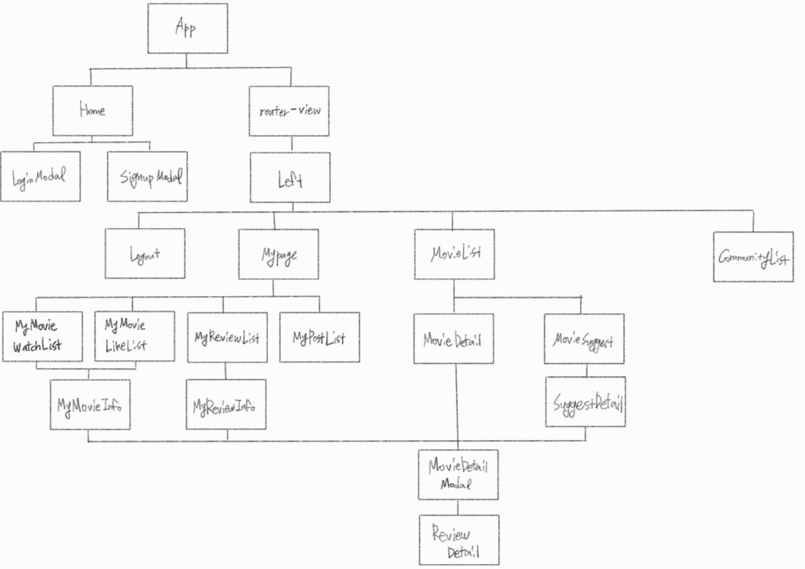
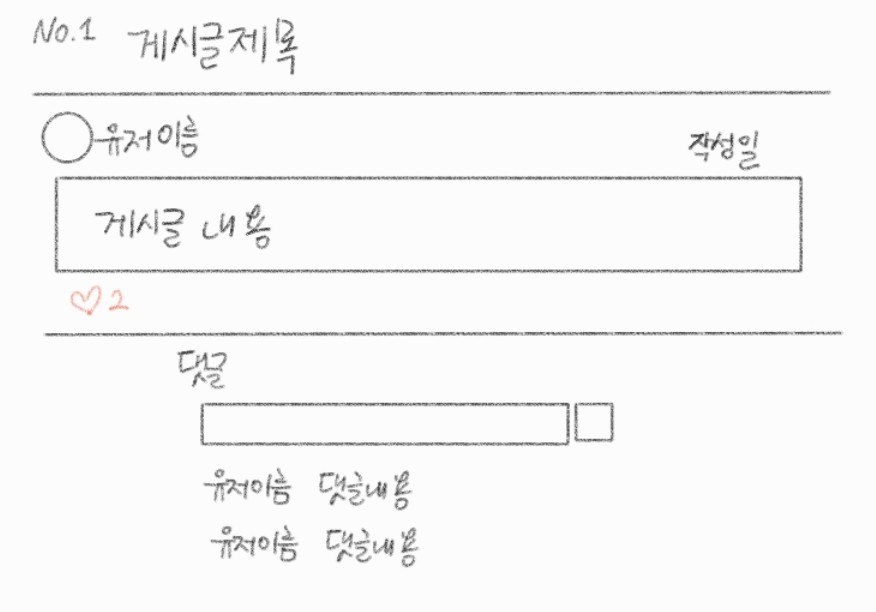

###### 210524

# Fifth Programming :deer:

> 아아아 디자인의 늪이다ㅏㅏ...

### :parasol_on_ground: 아이디어 및 수정할 부분

- **Signup페이지** :  새로 모달창을 띄우자
- 사이드메뉴 Home에 안나오게 하는 것 : 해결 가능할 듯...?
- **내가 쓴 리뷰** 부분 : 영화 **포스터 누르면 상세 페이지** 뜨도록!
- **영화 리스트** : 상세보기 누르기 전에는 **좋아요 몇명인지** 안뜬다ㅜ 이런거 **수정 필요**!

<br>

### 오전

1. mypages - **MyReviewList**

   - 내가 쓴 리뷰옆에 영화 포스터를 보여주고, **포스터를 통해 영화 상세페이지에 접근**할 수 있도록 하자

   - `Backend 수정`

     - 현재 들어오는 데이터 : 리뷰내용, 유저, 평점, 영화 pk
     - **필요한 데이터** : 리뷰가 달린 영화 정보, 좋아요 수
     - 내 리뷰페이지에 들어오면 `movies/<int:movie_pk>/`와 `movies/<int:movie_pk>/like/`로 각각 **영화 정보**와 **영화 좋아요 정보**를 받아오자

     ##### :fire: 서로 다른 url로 정보 요청하는 경우의 문제점

     - `비동기` 요청이기때문에 데이터를 전부 받아오기 전에 사용하게 된다
     - 데이터를 한번에 받아올 필요가 있다!!

     ##### :four_leaf_clover: 함수를 새로 만들자

     - `account/mypage/mypost/`로 접근하여 리뷰에 필요한 정보를 받아온다

     - `my_review_movie` 

       user가 작성한 모든 리뷰의 **movie_pk**값을 저장

       for문 사용해 해당 영화에 하나씩 접근한다

       ```python
       my_review_movie = request.user.user_review.all().values('movie_id')
       for movie in my_review_movie:
           #생략
       return Response(context)
       ```

     - `movie_info`

       영화 정보를 **MovieSerializer**의 **data**를 저장한다 (**dict 형태**)

       `count` : 영화를 좋아요한 유저 수를 저장

       `like` : 해당 유저의 좋아요 여부를 저장

       ```python
       my_movie = get_object_or_404(Movie, pk=movie['movie_id'])
                   movie_info = MovieSerializer(my_movie).data
                   # 해당 영화를 좋아요한 사람 수
                   movie_info['count'] = my_movie.movie_liked_user.count()
       
                   # 현재 유저가 좋아한 영화에 해당 영화가 있는 경우
                   if request.user.like_movie.filter(pk=movie['movie_id']).exists():
                       movie_info['like'] = True
                   # 영화가 없는 경우
                   else:
                       movie_info['like'] = False
       ```

     - `my_movies`

       movie_info를 array에 담고, dict 형태로 응답한다

       ```python
       my_movies.append(movie_info)
       ```

       ```python
       context = {
           'my_movies': my_movies,
       }
       ```

<br>

:cake: 점심 뇸뇸... 뭐했다고 점심시간...????

<br>

### 오후

1. **MyReviewInfo**

   - 나의 리뷰 상세 정보

   - `props` : **movie**, **myreview**, **like**, **likeCount**

   - 영화 상세페이지는 `MovieDetailModal` 재사용

   - `reviewDelete()`

     - 영화 상세페이지에서 내 리뷰 지우면, 내 페이지에서도 정보 지움
     - **emit** 으로 삭제 이벤트 발생 전달

     ```js
     reviewDelete() {
       this.$emit('review-delete')
     },
     ```

     - **MyReviewList**에서 리뷰 정도 재로드 (`loadMovie()`)

     ```js
     // 리뷰 삭제되면 다시 로드에서 내 페이지에 변화 적용
     reviewDelete () {
       this.loadMovie()
     },
     ```

2. **전체적인 component 구조 파악**

   - 처음보다 추가된 내용도 많아지고... 

   - 겹치는것 재사용 하면서 연결관계가 헷갈리기 시작ㅜ

   - 당장 폴더 정리하기엔 시간도 부족하고 꼬일 것 같아서 **일단 구조만 파악**해두기로 했다

     

     ##### :fire_engine: 복잡... 나중에 프로젝트 끝나면 component 정리좀 하자

###### 마이페이지 리뷰 부분만 했는데... 벌써 2시인거 실화...? 나 왜이렇게 느릴까

3. mypage - **MyPostList**

   - 커뮤니티에 내가 쓴 글 정보를 보여주자

   - **데이터**

     - `현재 데이터` : 게시글 제목, 작성자, 작성 일시, 수정 일시
     - `필요한 데이터` : 좋아요 수, 댓글 수

   - **Backend 수정**

     - 정보가 적어서 기존에 `account/mypage/`에서 데이터를 추가해서 전달하기로 결정

     - `my_posts`

       내가 쓴 모든 게시글 정보

       for문을 통해 하나하나에 접근하여 필요한 데이터를 가져온다

       ```python
       my_posts= user.user_post.all().values()
       for post_info in my_posts:
         #생략
       
       return JsonResponse(context, status=status.HTTP_200_OK)
       ```

     - `post_info`

       내가 쓴 게시글 하나의 정보

       `comment_count` : 댓글 개수

       `like_count` : 좋아요 개수

       **my_post**에 post_info를 담아 모든 게시글 정보를 한번에 전달

       ```python
       for post_info in my_posts:
           # 게시글 정보
           post = get_object_or_404(Post, pk=post_info['id'])
           # 댓글 갯수
           post_info['comment_count'] = post.post_comment.count()
           # 좋아요 개수
           post_info['like_count'] = post.post_liked_user.count()
           my_post.append(post_info)
       ```

4. **MyPostList 디자인**

   - **여러가지 게시글 정보**를 **깔끔하게** 보여주는 방법이 뭐가 있을까 :thinking:

   - :bulb: `영화 포스터 배열한 것 처럼 배열`해보자!!

     

     ###### 이런느낌...??? 괜찮은지 잘 모르겠다

<br>

#### Merge conflict 나는 경우

> 매번 헷갈려서... 한번 적어두고 가자

- local에서 **master** (내가 합치고 싶은 branch)로 이동

- **merge** 시도

  branch_name : 현재 branch와 합치고 싶은 branch 이름

  ```shell
  $ git merge branch_name
  ```

- **충돌하는 부분 수정**

- git **add** / **commit** 하면 merge 완료

  ###### 여기까지 하면 나의 local에서는 merge완료

- git **push** 해서 온라인에도 적용하기

<br>

5. **community 디자인**

   - `our Playground` : 우리들의 놀이터라는 느낌으로 이름을 붙여봤다

   - `CommunityList` : 가장 흔한 Table 형식으로 디자인

   - `CommunityDetail`

     - 최대한 깔끔하게..?
     - 인스타 피드를 참고해서 디자인했다!!!

     

     ###### 이거 보기보다 힘들다...

     - 화면 크기에 따라 달라지는건 이번엔 포기... 반응형을 고려하기엔 시간이 촉박하다ㅜ
     - 제목 길어지는 경우도 깔끔해 비슷한 형식을 유지하도록 조정했다

6. **댓글 form 커스텀**

   - 어두운 배경이라 테두리는 흰색, 배경은 검은색으로 바꾸고 싶은데...
   - 생각보다 커스텀이 잘 안된다
   - 일단 패스..

7. **댓글 최신순을 위로 배치**

   ##### :fire: server에서 역순으로 보내주기

   - post정보를 받아올 때, serializer에 정의되어있어서 그냥 가져오는 형태
   - 역순으로 바꿔줄 수 없다

   ```python
   post_comment = CommentSerializer(many=True, read_only=True)
   ```

   ##### :four_leaf_clover: Client에서 역순으로 바꾸기

   - 정보를 받자마자 역순으로 바꿔주자!
   - 배열이기때문에 **reverse()** 사용 가능

   ```js
   this.comments = res.data.post_comment.reverse()
   ```

<br>

<br>

## 오늘의 느낀점 :pray:

- 페어님 잘만나서 아주 좋습니다ㅜㅜㅜ
- 페어님께서 특이한 기능들을 주로 만들어주셔서 나는 세부적인 부분에 집중할 수 있었다!
- 기능들 시도했다가 실패했던 전적이...ㅎㅎㅎ
- 세부적인 거라도 할 수 있는게 있어서 다행이랄까..??
- 그래서 열심히 디자인 예쁘게 하려고 노력 중!!!
- 원하는 대로 커스텀 하고싶다구우... 커스텀 넘나 힘들다
- 기능이 추가될 수록 **함수도 복잡**해지고 **component 구조도 복잡**해지구...
- 처음에 **전체적인 구조를 정말 완벽히 짜고 하던지!**
- 그게 아니면 **기능별로 함수 구분 잘 하고**, component도 **기능별로 폴더 구분**하면서 하는게 정말 중요!!! :star::star::star: